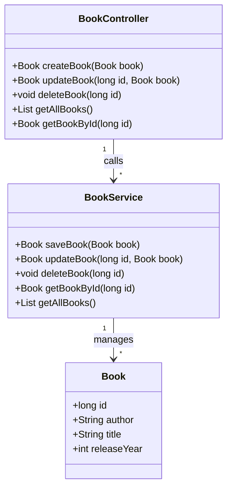

# Bookstore API
Java RESTful API criada para a Decola Tech 2025.

# Diagrama de Classes

```mermaid
classDiagram
    class Book {
        +long id
        +String author
        +String title
        +int releaseYear
    }

    class BookService {
        +Book saveBook(Book book)
        +Book updateBook(long id, Book book)
        +void deleteBook(long id)
        +Book getBookById(long id)
        +List<Book> getAllBooks()
    }

    class BookController {
        +Book createBook(Book book)
        +Book updateBook(long id, Book book)
        +void deleteBook(long id)
        +List<Book> getAllBooks()
        +Book getBookById(long id)
    }

    BookController "1" --> "*" BookService : calls
    BookService "1" --> "*" Book : manages
```
